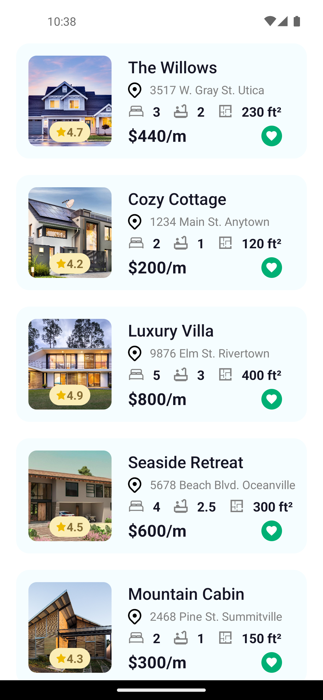
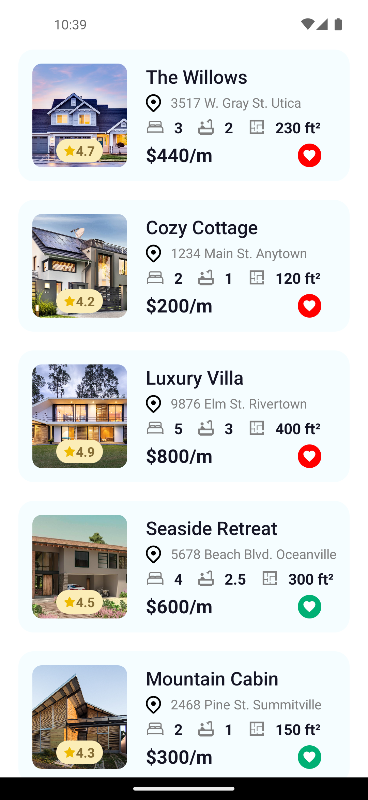

# App Inmobiliaria

# Table of content
- [Description](#description)
- [How to Install](#how-to-install)
- [Run the Project](#how-to-run-the-project)
- [How to Use the Project](#how-to-use-the-project)
- [Credits](#credits)
- [Badges](#badges)

# Description
An application that allows a real estate business to showcase available houses for rent to clients, along with their respective information.
# How to install 
This project can be easily installed by following these steps:

1. Clone or download this repo
1. Open a terminal and run the command `npm install`
1. This is a bare React Native project created with React Native CLI, so if you don't have it installed, you will need to install it. [You can find an installation guide here in the official documentation](https://reactnative.dev/docs/environment-setup)
# How to run the project
1. Open an Android/iOS emulator or connect an Android device to your PC
1. Open a terminal and execute one of the following commands: 
   - For Android emulator/device, run `npx react-native run-android`
   - For an iOS emulator, run `npx react-native run-ios`
# How to use the project
You can view the list of houses registered in the JSON file. Additionally, you can utilize the like button and observe how it changes.

# Credits
 - [Coded by BrandonVG](https://github.com/BrandonVG)

# Badges
## CodeClimate badge

## Codacy badge
